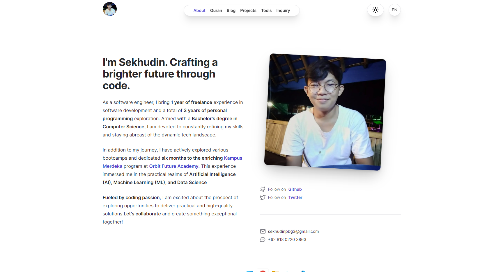
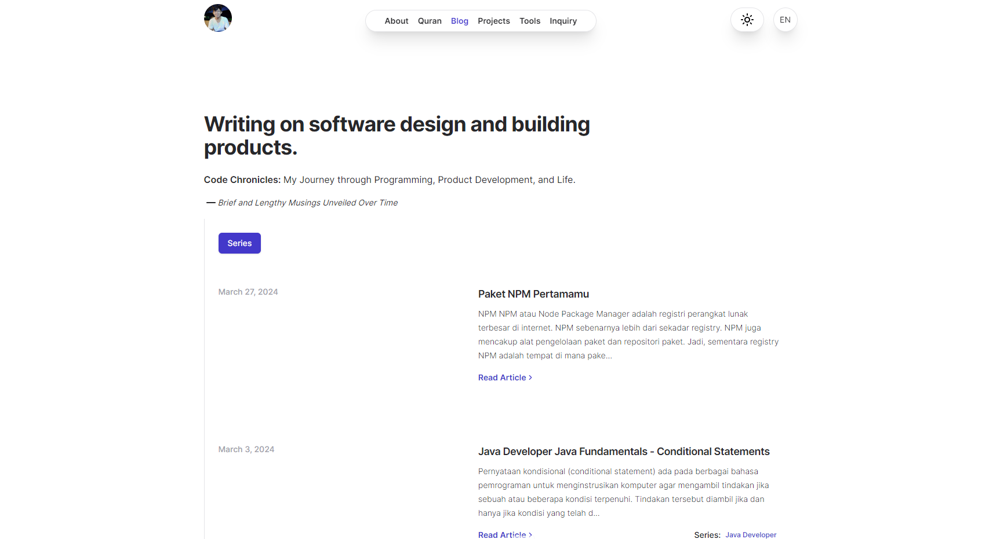
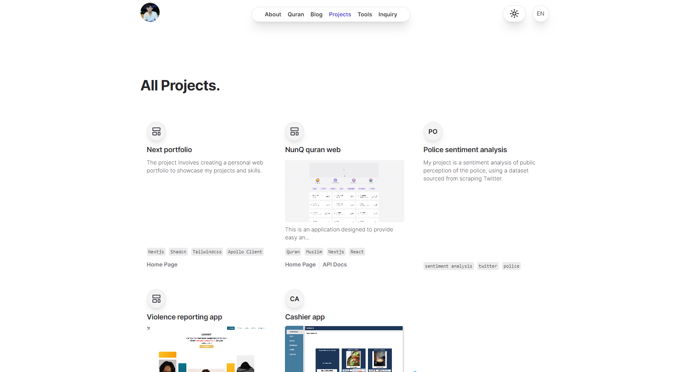
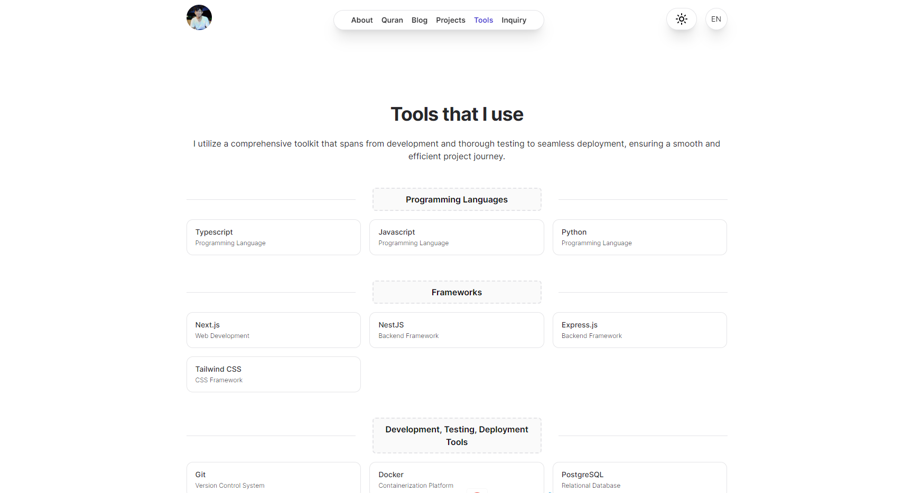
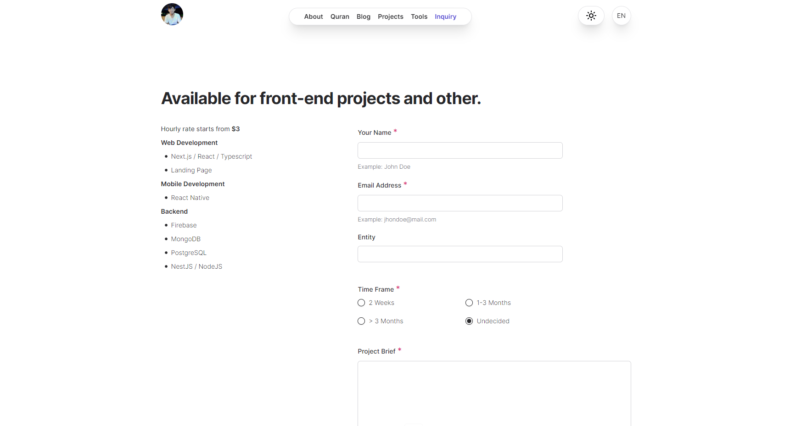

# Next.js Portfolio Website

## Overview

This project is a personal portfolio website built with [Nextjs](https://nextjs.org), a React framework for production. The website showcases work, skills, and experiences as a profetional. It includes sections such as an about page, project showcases, a blog integrated with Hashnode, and a contact form for inquiries. The goal of this project is to provide a platform to present professional portfolio in an elegant and modern manner.

**My Portfolio** : [www.syaikhu.com](https://www.syaikhu.com)

## Features

- **Responsive Design**: Optimized for various devices and screen sizes.
- **Hashnode Integration**: Blog posts are managed and displayed using Hashnode, allowing for seamless content management.
- **GitHub Integration**: Integrated with github to show repositories.
- **Contact Form**: Includes a contact form for easy communication.
- **Dark Mode**: Supports dark mode for a better user experience.

## Technologies Used

- **Next.js**: React framework for server-side rendering, static site generation, and more.
- **React**: JavaScript library for building user interfaces.
- **Tailwind CSS**: Utility-first CSS framework for styling.
- **Apollo Client**: State management library for handling GraphQL data.
- **Graphql**: Query language for your API.

## Pages

- **About**: Information about me, my background, and my skills.
  
- **Blog**: A collection of blog posts with Hashnode integration.
  
- **Projects**: Showcase of projects with Github integration.
  
- **Technologies Used**: Information about the technologies and tools frequently used.
  
- **Inquiry**: A contact form for inquiries and communication.
  

## Getting Started

To get a local copy up and running, follow these simple steps:

### Variable Environtments

```bash
# Public Contact
NEXT_PUBLIC_CONTACT_WHATSAPP=
NEXT_PUBLIC_CONTACT_EMAIL=

# Public Social Media
NEXT_PUBLIC_GITHUB=
NEXT_PUBLIC_LINKEDIN=
NEXT_PUBLIC_TWITTER=
NEXT_PUBLIC_INSTAGRAM=

# public
NEXT_PUBLIC_BASE_URL=
NEXT_PUBLIC_HASHNODE_MY_HOST=
NEXT_PUBLIC_HASHNODE_EP=
NEXT_PUBLIC_HASHNODE_ACCESS_TOKEN=

NEXT_PUBLIC_GITHUB_APP_NAME=
NEXT_PUBLIC_GITHUB_EP=
NEXT_PUBLIC_GITHUB_ACCESS_TOKEN=

NEXT_PUBLIC_EMAILJS_SERVICE_ID=
NEXT_PUBLIC_EMAILJS_TEMPLATE_ID=
NEXT_PUBLIC_EMAILJS_PUBLIC_KEY=
```

For the development process, create `.env.development` file, and create `.env.production` for production process.

### Instalation

1. Clone the repository:
   ```bash
   git clone https://github.com/Sekhudin/next-portfolio.git
   ```
2. Navigate to the project directory:
   ```bash
   cd next-portfolio
   ```
3. Install dependencies:
   ```bash
   npm install
   ```
4. Fetching graphql types:
   ```bash
   npm run gen:hashnode
   npm run gen:github
   ```
5. Run the development server:
   ```bash
   npm run dev
   ```
   Open http://localhost:3000 to view it in your browser.

### Usage

1. **Adding Projects**: Create a new public repository on GitHub, and it will automatically be displayed on the projects page with a link to the repository.<br>
   **Cover**(_optional_):<br>
   Add the file `cover.png` to the `public` folder of your repository. It will automatically be displayed as the **project cover**.<br>
   **Description**(_optional_):<br>
   In the description, if you want to add a **type**, use the tags `<web/>`, `<mobile/>`, `<desktop/>`, or `<package/>` in repository description.<br>
   if you want to add **tags**, use the tag `<tag>tag</tag>` (single tags), use the tag `<tag>tag1&&tag2&&tag3</tag>` (multiple tag).<br>
   if you want to add **url**, use tag `api`, `home`, example `<api>example.com</api>`.

2. **Writing Blog Posts**: Write your blog posts on Hashnode, and they will be displayed on the blog page.
3. **Configuartion**: Other configurations are available in the `configs` folder.
4. **Customizing**: Modify the content in the pages and components directories to customize the website to your liking.

## Contact

- **Email** : sekhudinpbg3@gmail.com
- **Web** : [syaikhu.com](https://www.syaikhu.com/)

### Find me on:

- **Linkedin** : [sekhudin](https://www.linkedin.com/in/sekhudin/)<br>
- **Instagram** : [@sekhudin_y](https://www.instagram.com/sekhudin_y)<br>
- **Twitter** : [@sekhudin_y](https://twitter.com/sekhudin_y)<br>
- **Trakteer** : [syaikhu](teer.id/syaikhu)

## Additional Information

For more information, visit the official [Next.js documentation](https://nextjs.org/docs).

## Support Me:
<a href="https://trakteer.id/syaikhu" target="_blank"></a>
